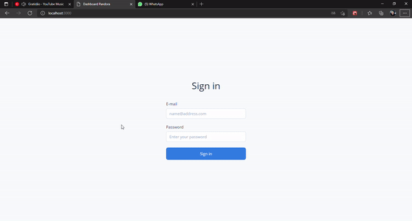

# Dashboard Pandora

---

## Configuração

Projeto iniciado com o cra-pandora, já trazendo configurações default como eslint, prettier, semantic release e custom paths.

---

## Estrutura

A estrutura segue um padrão de componentes de modularizado, fazendo a utilização de contexts api e styled components.

---

## Hooks

- **useAuth**: Responsável por total parte de autenticação;
- **useMenu**: Responsável por carregar os menus;
- **useSidebar**: Responsável por controlar a abertura ou fechamento do sidebar;
- **useStorage**: Responsável por interagir com o local storage;
- **useTheme**: Responsável por lidar com o tema do sistema;

---

## Author

[ @lucas-eduardo](https://github.com/lucas-eduardo)